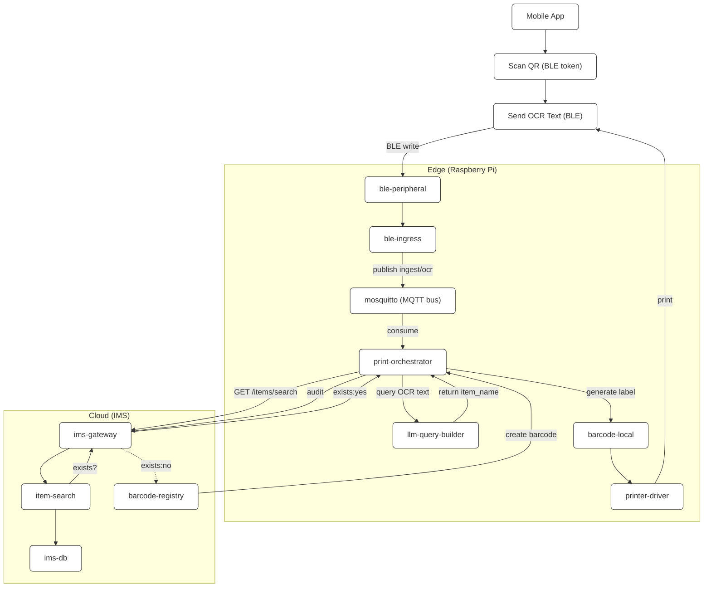
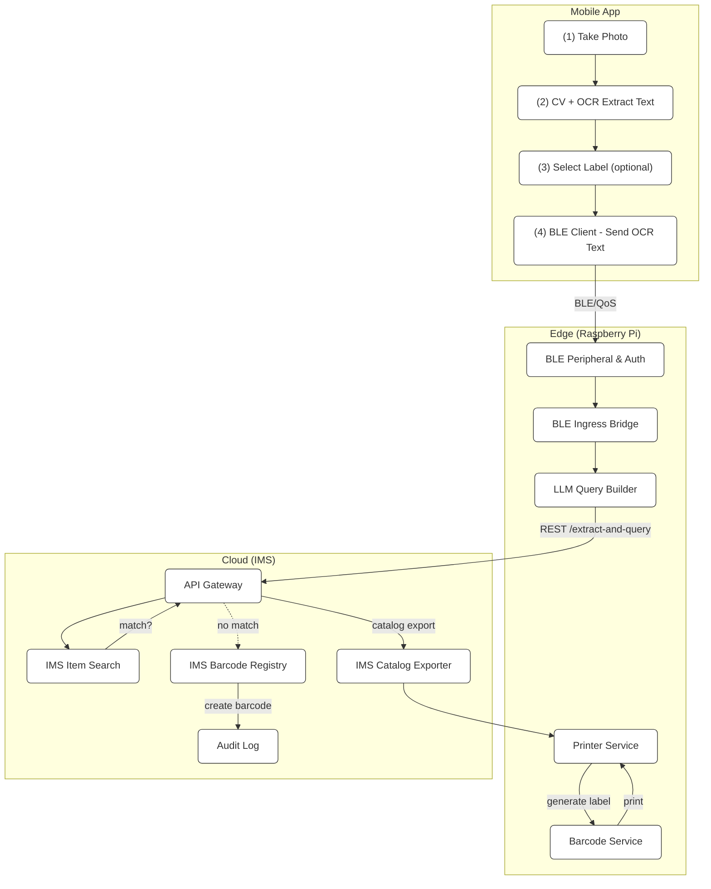

# Inventory Barcode Integration Edge

An MQTT-first edge deployment that listens for product payloads, renders
print-ready labels with barcodes or QR codes, and sends them to a Brother QL
printer. The stack runs entirely in Docker so it can be deployed on a
Raspberry Pi or any Linux host that can access the printer over USB.

This repository supersedes the earlier "Inventory Label Automation System"
concept. The practical code that ships here is focused on the MQTT printer
workflow, while the original SOA design is retained below as a reference
architecture for future expansion.

## Stack Overview

- **mqtt_bridge** – bridges messages from a remote MQTT broker (e.g. HiveMQ
  Cloud) onto the local broker so the printer stack can run offline.
- **mqtt_broker** – Eclipse Mosquitto with MQTT + WebSocket listeners.
- **mqtt_printer_listener** – converts messages delivered on
  `lobby/lift/packages` into ready-to-print labels by calling
  `printer/code/print.py`.
- **printer/code** – label rendering and printer control logic (barcodes,
  QR generation, rasterisation, and Brother QL USB output).

```
docker-compose.yml
├── mqtt_bridge/
├── mqtt_broker/
└── mqtt_printer_listener/
    └── mounts ./printer/code -> /code inside the container
```

## Requirements

- Docker Engine 24+
- docker compose plugin
- Brother QL series printer accessible over USB
- Optional: internet access for the remote MQTT broker

## Quick Start

```bash
git clone https://github.com/anandarupmukherjee/inventory_barcode_integration_edge.git
cd inventory_barcode_integration_edge
docker compose up -d
```

By default the bridge listens to `broker.hivemq.com` on topic
`lobby/lift/packages`. Edit `docker-compose.yml` to point at your own broker or
override the environment variables listed below.

## Environment Variables

| Service                 | Variable              | Purpose                                      |
|-------------------------|-----------------------|----------------------------------------------|
| `mqtt_bridge`           | `REMOTE_MQTT_HOST`    | Remote broker hostname                       |
|                         | `REMOTE_MQTT_TOPIC`   | Topic to mirror from remote broker           |
|                         | `LOCAL_MQTT_TOPIC`    | Topic to publish to on the local broker      |
| `mqtt_printer_listener` | `MQTT_HOST`           | Local broker hostname                        |
|                         | `MQTT_TOPIC`          | Topic to subscribe to for label payloads     |
|                         | `PRINTER_IDENTIFIER`  | Brother QL USB identifier (e.g. `usb://...`) |
|                         | `PRINTER_MODEL`       | Brother QL model, defaults to `QL-700`       |

Payloads should be JSON objects. If the payload already contains
`labelItems`, they are passed straight to `print.py`. Otherwise the listener
builds a label with the product name, optional note, timestamp, and a QR code.

## Label Rendering Notes

- `printer/code/print.py` auto-creates `barcodes`, `QR`, and `output`
  directories at runtime; generated assets are ignored via `.gitignore`.
- The bundled font is `DejaVuSans-Bold.ttf`. Replace it or adjust `print.py`
  if you need a different typeface.
- `QRPrint.makeLabelAAS` supports large payloads by chunking/compressing
  before QR encoding.

## Maintenance

- To stop the stack run `./stop.sh`.
- Logs can be tailed with `docker compose logs -f mqtt_printer_listener`.
- Tests are currently manual. When making changes to `print.py` you can feed a
  sample payload with `python3 printer/code/print.py '<payload>'`.

---

## Reference SOA Architecture (Original Plan)

The material below captures the broader service-oriented architecture that
inspired this project. It describes how a Raspberry Pi edge stack might work in
concert with a cloud Inventory Management System (IMS) to create labels from OCR
text captured on a mobile device.

### Inventory Label Automation System (SOA Architecture)

This repository defines a **service-oriented architecture (SOA)** for the
Raspberry Pi–based inventory label automation system. Each component runs in its
own container and communicates via well-defined APIs or MQTT topics.

### Overview

The system automates label creation for items using OCR text captured by a
mobile app and verified against a cloud Inventory Management System (IMS). The
Raspberry Pi acts as the **edge orchestrator**, hosting several modular services
that process, query, and print labels.

### Edge (Raspberry Pi) Services

| Service | Purpose | Interface |
|---------|---------|-----------|
| **ble-peripheral** | Exposes BLE GATT service for app connection and authentication (via QR token). | BLE characteristics (`/auth`, `/msg`, `/ack`) |
| **ble-ingress** | Converts BLE messages into MQTT payloads for downstream processing. | Subscribes to BLE; Publishes to `ingest/ocr` |
| **llm-query-builder** | Uses a lightweight LLM to extract the item name from OCR text and build IMS API query URLs. | REST: `POST /extract-and-query` |
| **print-orchestrator** | Coordinates LLM, IMS, barcode, and printer actions; decides whether to print or create new barcodes. | MQTT subscriber `ingest/ocr` / REST `/print` |
| **barcode-local** | Generates local barcode images (e.g., Code128, GS1). | REST: `POST /barcode` |
| **printer-driver** | Sends printable jobs to the Brother QL-700 printer. | REST: `POST /print-job` |
| **config-watcher** | Periodically fetches item catalogs from the IMS to refresh local cache. | Cron or REST download |
| **mosquitto** | MQTT broker used for internal decoupling of edge services. | MQTT on port 1883 |
| **telemetry** | Provides health checks, logs, and metrics. | REST: `/healthz`, `/metrics` |

### Cloud (IMS) Services

| Service | Purpose | Interface |
|---------|---------|-----------|
| **ims-gateway** | Entry point for all edge requests, authentication, routing, rate limiting. | REST over HTTPS |
| **item-search** | Searches for existing items by name in the catalog. | `GET /items/search?q=` |
| **barcode-registry** | Creates and manages barcode–item mappings. | `POST /barcodes`, `POST /barcodes/map` |
| **catalog-exporter** | Provides downloadable item name lists for edge caching. | `GET /export/item_catalog.json` |
| **audit-log** | Records print job and mapping audit events. | `POST /events/print_job` |
| **auth** | Issues and validates tokens for Edge → Cloud communication. | OAuth2 / JWT |
| **ims-db** | Persistent store for catalog, barcodes, and logs. | PostgreSQL |

### Service Interactions



### inventory_barcode_integration_edge Diagram



The diagrams and tables remain for planning purposes if the project expands
beyond the current MQTT printing workflow.
