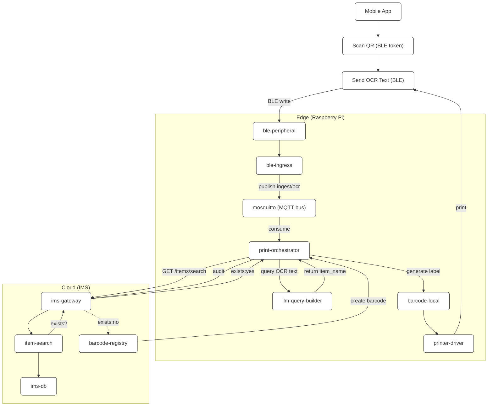
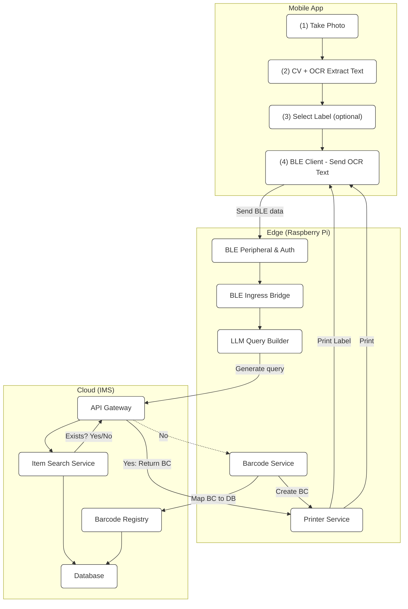
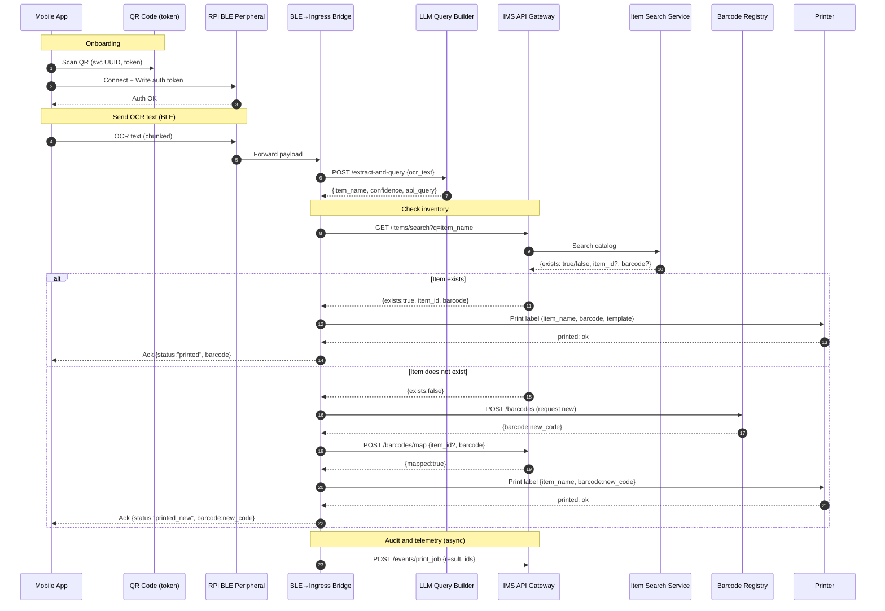

# Inventory Label Automation System (SOA Architecture)

This repository defines a **service-oriented architecture (SOA)** for the Raspberry Pi–based inventory label automation system.  
Each component runs in its own container and communicates via well-defined APIs or MQTT topics.

---

## Overview

The system automates label creation for items using OCR text captured by a mobile app and verified against a cloud Inventory Management System (IMS).  
The Raspberry Pi acts as the **edge orchestrator**, hosting several modular services that process, query, and print labels.

---

## Services and Roles

### **Edge (Raspberry Pi)**

| Service | Purpose | Interface |
|----------|----------|------------|
| **ble-peripheral** | Exposes BLE GATT service for app connection and authentication (via QR token). | BLE characteristics (`/auth`, `/msg`, `/ack`) |
| **ble-ingress** | Converts BLE messages into MQTT payloads for downstream processing. | Subscribes to BLE; Publishes to `ingest/ocr` |
| **llm-query-builder** | Uses a lightweight LLM to extract the item name from OCR text and build IMS API query URLs. | REST: `POST /extract-and-query` |
| **print-orchestrator** | Coordinates LLM, IMS, barcode, and printer actions; decides whether to print or create new barcodes. | MQTT subscriber `ingest/ocr` / REST `/print` |
| **barcode-local** | Generates local barcode images (e.g., Code128, GS1). | REST: `POST /barcode` |
| **printer-driver** | Sends printable jobs to the Brother QL-700 printer. | REST: `POST /print-job` |
| **config-watcher** | Periodically fetches item catalogs from the IMS to refresh local cache. | Cron or REST download |
| **mosquitto** | MQTT broker used for internal decoupling of edge services. | MQTT on port 1883 |
| **telemetry** | Provides health checks, logs, and metrics. | REST: `/healthz`, `/metrics` |

---

### **Cloud (IMS)**

| Service | Purpose | Interface |
|----------|----------|------------|
| **ims-gateway** | Entry point for all edge requests, authentication, routing, rate limiting. | REST over HTTPS |
| **item-search** | Searches for existing items by name in the catalog. | `GET /items/search?q=` |
| **barcode-registry** | Creates and manages barcode–item mappings. | `POST /barcodes`, `POST /barcodes/map` |
| **catalog-exporter** | Provides downloadable item name lists for edge caching. | `GET /export/item_catalog.json` |
| **audit-log** | Records print job and mapping audit events. | `POST /events/print_job` |
| **auth** | Issues and validates tokens for Edge → Cloud communication. | OAuth2 / JWT |
| **ims-db** | Persistent store for catalog, barcodes, and logs. | PostgreSQL |

---

## Service Interactions

# inventory_barcode_integration_edge

# Sequence of Operations

